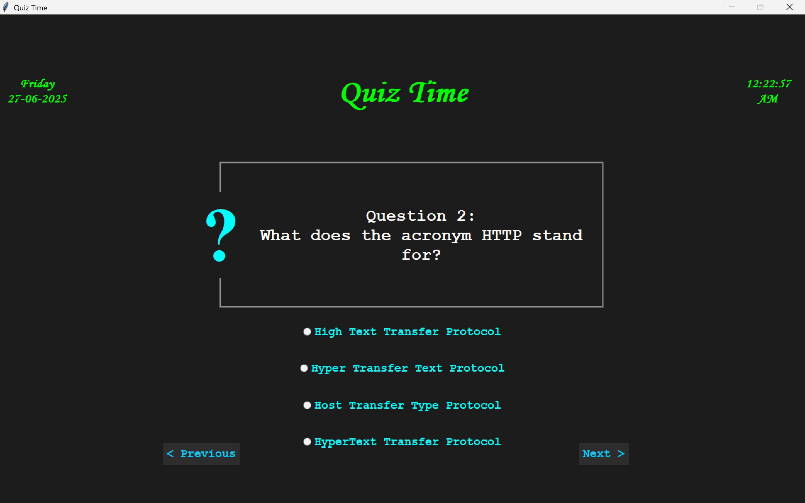
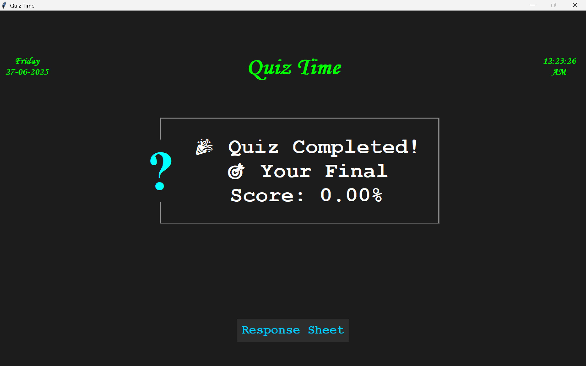

# 🧠 Quiz App (MCQ GUI)

## 📌 Project Overview

This **Quiz App** is a desktop-based multiple-choice quiz interface built using **Python (Tkinter)**. It was developed as part of the **RISE (Real‑time Internship & Skill Enhancement)** program by **Tamizhan Skills**.
The app helps users **practice MCQs interactively**, simulating the experience of competitive exams while providing a fun, engaging way to learn.

---

## 🏁 About RISE

**RISE** is a free, hands-on internship initiative that bridges academic learning with real-world applications through guided projects in diverse domains such as:

* 🧠 Artificial Intelligence
* 💻 Web Development
* 📊 Data Science
* 📱 App Development
* 🐍 Python Programming (my chosen domain)
* 🔌 IoT
* 🛠️ and more...

---

## 🔧 Project 4: Quiz App Using Tkinter

### 📝 Problem Statement

Students preparing for competitive exams often need a platform to test their knowledge with instant feedback. Practicing MCQs in a quiz format enhances retention and confidence.

---

### 🎯 Objective

Design a Python GUI application to simulate a multiple-choice quiz where:

* Users can select an answer from four options
* Navigate between questions
* View final scores and answer summary

---

### 🛠️ Requirements

* ✅ Display MCQs with 4 options
* ✅ Allow users to select and change answers
* ✅ Navigation: **Next** and **Previous** buttons
* ✅ Display score after the quiz ends
* ✅ Optional: Load questions from external **JSON file**

---

## 🚀 Features

* ✅ GUI-based question and answer layout using **Tkinter**
* ✅ Real-time **Clock and Date display** in header
* ✅ Load MCQs from a JSON file (`Questions.json`)
* ✅ Display of **selected vs correct answer** at the end
* ✅ Quiz progress navigation with **Next/Previous** buttons
* ✅ **Final score** shown in percentage format
* ✅ Color-coded and styled interface for better UX

---

## 📂 Technologies Used

| Component             | Description                              |
| --------------------- | ---------------------------------------- |
| **Python 3.9+**       | Core programming language                |
| **Tkinter**           | GUI toolkit                              |
| **json**              | For loading external question data       |
| **Pillow** (optional) | For adding image support (not used here) |
| **ttk & tkfont**      | Enhanced widget styling and custom fonts |

---

## 🧑‍💻 How to Run

1. Make sure you have **Python 3.9 or above** installed.

2. Clone or download this repository.

3. Make sure you have a valid `Questions.json` file in the same directory. Example format:

   ```json
   [
     {
       "ID": 1,
       "Q": "What is the capital of India?",
       "choices": ["Mumbai", "Delhi", "Kolkata", "Chennai"],
       "A": "Delhi"
     },
     ...
   ]
   ```

4. Run the application:

   ```bash
   python quiz_app.py
   ```

---

## 📸 Screenshots

\


---

## 📊 Expected Outcome

* A fully functional, interactive **quiz-taking application**
* Skills gained:

  * File handling (JSON)
  * GUI layout management (Tkinter)
  * Event-driven programming
  * User response tracking and evaluation

---

## 📢 Credits

This project is developed under the **RISE Internship** by [Tamizhan Skills](https://www.tamizhanskills.com)\
Created by: **Akarsh Kumar**\
Domain: **Python Programming**

---

## 🗂️ Suggested File Structure

```
project_root/
├── quiz_app.py
├── Questions.json
├── README.md
└── screenshots/
    ├── question_ui.png
    ├── result_summary.png
```

---
